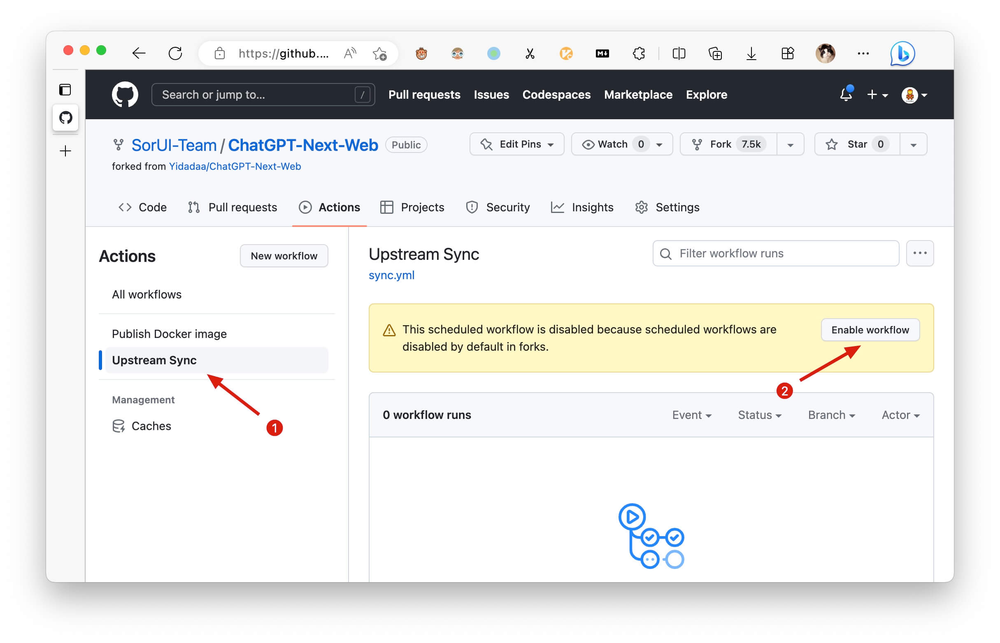

<h1 align="center">ChatGPT Next Web</h1>

Englisch / [简体中文](./README_CN.md) / [日本語](./README_JA.md)

Mit einem Klick erhalten Sie eine gut gestaltete plattformübergreifende ChatGPT-Web-Benutzeroberfläche.

一键免费部署你的跨平台私人 ChatGPT 应用。

[![Web][Web-Bild]][web-url]
[![Windows][Windows-Bild]][download-url]
[![MacOS][MacOS-Bild]][download-url]
[![Linux][Linux-Bild]][download-url]

[Web App](https://chatgpt.nextweb.fun/) / [Desktop App](https://github.com/Yidadaa/ChatGPT-Next-Web/releases) / [Discord](https://discord.gg/YCkeafCafC) / [Twitter](https://twitter.com/mortiest_ricky) / [Buy Me a Coffee](https://www.buymeacoffee.com/yidadaa)

[网页版](https://chatgpt.nextweb.fun/) / [客户端](https://github.com/Yidadaa/ChatGPT-Next-Web/releases) / [反馈](https://github.com/Yidadaa/ChatGPT-Next-Web/issues) / [QQ 群](https://github.com/Yidadaa/ChatGPT-Next-Web/discussions/1724) / [打赏开发者](https://user-images.githubusercontent.com/16968934/227772541-5bcd52d8-61b7-488c-a203-0330d8006e2b.jpg)

[web-url]: https://chatgpt.nextweb.fun
[download-url]: https://github.com/Yidadaa/ChatGPT-Next-Web/releases
[Web-Bild]: https://img.shields.io/badge/Web-PWA-orange?logo=microsoftedge
[Windows-Bild]: https://img.shields.io/badge/-Windows-blue?logo=windows
[MacOS-Bild]: https://img.shields.io/badge/-MacOS-black?logo=apple
[Linux-Bild]: https://img.shields.io/badge/-Linux-333?logo=ubuntu

## Funktionen

- **Kostenlose Bereitstellung mit einem Klick** auf Vercel in weniger als 1 Minute
- Kompakter Client (~5 MB) für Linux/Windows/MacOS, [jetzt herunterladen](https://github.com/Yidadaa/ChatGPT-Next-Web/releases)
- Vollständig kompatibel mit selbstbereitgestellten LLMs, empfohlen für die Verwendung mit [RWKV-Runner](https://github.com/josStorer/RWKV-Runner) oder [LocalAI](https://github.com/go-skynet/LocalAI)
- Datenschutz zuerst, alle Daten werden lokal im Browser gespeichert
- Unterstützung von Markdown: LaTex, Mermaid, Code-Hervorhebung usw.
- Responsive Gestaltung, Dunkelmodus und PWA
- Schnelle Ladezeit der ersten Seite (~100 KB), Unterstützung für Streaming-Antworten
- Neu in Version 2: Erstellen, Teilen und Debuggen Ihrer Chat-Tools mit Promptvorlagen (Masken)
- Großartige Prompts unterstützt von [awesome-chatgpt-prompts-zh](https://github.com/PlexPt/awesome-chatgpt-prompts-zh) und [awesome-chatgpt-prompts](https://github.com/f/awesome-chatgpt-prompts)
- Komprimiert automatisch den Chat-Verlauf, um lange Gespräche zu unterstützen und gleichzeitig Ihre Tokens zu speichern
- I18n: Englisch, 简体中文, 繁体中文, 日本語, Français, Español, Italiano, Türkçe, Deutsch, Tiếng Việt, Русский, Čeština, 한국어, Indonesia

## Roadmap

- [x] System-Prompt: Einen benutzerdefinierten Prompt als System-Prompt anheften [#138](https://github.com/Yidadaa/ChatGPT-Next-Web/issues/138)
- [x] Benutzer-Prompt: Benutzer können benutzerdefinierte Prompts bearbeiten und speichern
- [x] Promptvorlagen: Erstellen Sie einen neuen Chat mit vordefinierten In-Context-Prompts [#993](https://github.com/Yidadaa/ChatGPT-Next-Web/issues/993)
- [x] Als Bild teilen, zu ShareGPT teilen [#1741](https://github.com/Yidadaa/ChatGPT-Next-Web/pull/1741)
- [x] Desktop-App mit Tauri
- [x] Selbstgehostetes Modell: Vollständig kompatibel mit [RWKV-Runner](https://github.com/josStorer/RWKV-Runner) sowie Serverbereitstellung von [LocalAI](https://github.com/go-skynet/LocalAI): llama/gpt4all/rwkv/vicuna/koala/gpt4all-j/cerebras/falcon/dolly usw.
- [ ] Plugins: Unterstützung von Netzwerksuche, Taschenrechner, anderen APIs usw. [#165](https://github.com/Yidadaa/ChatGPT-Next-Web/issues/165)

## Was ist neu

- 🚀 Version 2.0 ist veröffentlicht, jetzt können Sie Promptvorlagen erstellen und Ihre Ideen in die Realität umsetzen! Lesen Sie dazu: [ChatGPT Prompt Engineering Tipps: Zero, One und Few Shot Prompting](https://www.allabtai.com/prompt-engineering-tips-zero-one-and-few-shot-prompting/).
- 🚀 Version 2.7 ermöglicht das Teilen von Unterhaltungen als Bild oder das Teilen von ShareGPT!
- 🚀 Version 2.8 bietet jetzt einen Client, der auf allen Plattformen läuft!

## Hauptfunktionen

- In 1 Minute mit Vercel **kostenlos bereitstellen**
- Kompakter Client (~5 MB) für Linux/Windows/MacOS, [jetzt herunterladen](https://github.com/Yidadaa/ChatGPT-Next-Web/releases)
- Volle Markdown-Unterstützung: LaTex, Mermaid, Code-Hervorhebung usw.
- Reaktionsschnelles Design, Dunkelmodus und PWA
- Schnelle Ladezeit der ersten Seite (~100 KB), Unterstützung für Streaming-Antworten
- Datenschutz zuerst, alle Daten werden lokal im Browser gespeichert
- Vorlagen für Prompts (Masken) erleichtern das Erstellen, Teilen und Debuggen Ihrer personalisierten Gespräche
- Tolle Prompts unterstützt von [awesome-chatgpt-prompts-zh](https://github.com/PlexPt/awesome-chatgpt-prompts-zh) und [awesome-chatgpt-prompts](https://github.com/f/awesome-chatgpt-prompts)
- Automatische Komprimierung des Chat-Verlaufs, um lange Gespräche zu unterstützen und gleichzeitig Ihre Tokens zu speichern
- Unterstützung für mehrere Sprachen: Englisch, 简体中文, 繁体中文, 日本語, Español, Italiano, Türkçe, Deutsch, Tiếng Việt, Русский, Čeština
- Wenn Sie Ihre eigene Domain haben, können Sie sie einfach binden und überall problemlos darauf zugreifen.

## Entwicklungsplan

- [x] System-Prompt: Einen benutzerdefinierten Prompt als System-Prompt anheften [#138](https://github.com/Yidadaa/ChatGPT-Next-Web/issues/138)
- [x] Benutzer-Prompt: Benutzer können benutzerdefinierte Prompts bearbeiten und speichern
- [x] Promptvorlagen: Erstellen Sie einen neuen Chat mit vordefinierten In-Context-Prompts [#993](https://github.com/Yidadaa/ChatGPT-Next-Web/issues/993)
- [x] Als Bild teilen, zu ShareGPT teilen [#1741](https://github.com/Yidadaa/ChatGPT-Next-Web/pull/1741)
- [x] Desktop-App mit Tauri
- [x] Selbstgehostetes Modell: Vollständig kompatibel mit [RWKV-Runner](https://github.com/josStorer/RWKV-Runner) sowie Serverbereitstellung von [LocalAI](https://github.com/go-skynet/LocalAI): llama/gpt4all/rwkv/vicuna/koala/gpt4all-j/cerebras/falcon/dolly usw.
- [ ] Plugins: Unterstützung von Netzwerksuche, Taschenrechner, anderen APIs usw. [#165](https://github.com/Yidadaa/ChatGPT-Next-Web/issues/165)

## Was ist neu

- 🚀 Version 2.0 ist veröffentlicht, jetzt können Sie Promptvorlagen erstellen und Ihre Ideen in die Realität umsetzen! Lesen Sie dazu: [ChatGPT Prompt Engineering Tipps: Zero, One und Few Shot Prompting](https://github.com/Yidadaa/ChatGPT-Next-Web/issues/138).
- 💡 Möchten Sie dieses Projekt bequemer überall nutzen? Probieren Sie dieses Desktop-Plugin aus: https://github.com/mushan0x0/AI0x0.com
- 🚀 Version 2.7 ermöglicht das Teilen von Unterhaltungen als Bild oder das Teilen von ShareGPT-Links!
- 🚀 Version 2.8 bietet jetzt einen Client, der auf allen Plattformen läuft!

## Erste Schritte

> [简体中文 > Wie man beginnt](./README_CN.md#开始使用)

1. Holen Sie sich einen [OpenAI-API-Schlüssel](https://platform.openai.com/account/api-keys);
2. Klicken Sie auf
   , merken Sie sich, dass `CODE` Ihr Seitenpasswort ist;
3. Genießen Sie :)

## FAQ

[简体中文 > Häufig gestellte Fragen](./docs/faq-cn.md)

[English > FAQ](./docs/faq-en.md)

## Bleiben Sie auf dem Laufenden

> [简体中文 > Wie man aktualisiert bleibt](./README_CN.md#保持更新)

Wenn Sie Ihr eigenes Projekt mit nur einem Klick gemäß den oben genannten Schritten bereitgestellt haben, kann es sein, dass ständig die Meldung "Updates verfügbar" angezeigt wird. Dies liegt daran, dass Vercel standardmäßig ein neues Projekt für Sie erstellt, anstatt dieses Projekt zu klonen, was dazu führt, dass Updates nicht richtig erkannt werden können.

Wir empfehlen Ihnen, die folgenden Schritte auszuführen, um erneut bereitzustellen:

- Löschen Sie das ursprüngliche Repository;
- Verwenden Sie die Fork-Schaltfläche oben rechts auf der Seite, um dieses Projekt zu klonen;
- Wählen Sie in Vercel erneut aus und bereiten Sie erneut zu, [lesen Sie bitte die ausführliche Anleitung](./docs/vercel-cn.md).

### Automatische Updates aktivieren

> Wenn die Ausführung von Upstream Sync fehlschlägt, führen Sie bitte einmal manuell eine Synchronisation der Gabel durch.

Nachdem Sie das Projekt geklont haben, müssen Sie aufgrund der von GitHub auferlegten Einschränkungen Workflows und Upstream Sync Action auf der Actions-Seite des geklonten Projekts manuell aktivieren. Sobald aktiviert, werden automatische Updates stündlich geplant:

### Manuelles Aktualisieren des Codes

Wenn Sie sofort aktualisieren möchten, können Sie die [GitHub-Dokumentation](https://docs.github.com/en/pull-requests/collaborating-with-pull-requests/working-with-forks/syncing-a-fork) überprüfen, um zu erfahren, wie Sie ein geklontes Projekt mit dem Upstream-Code synchronisieren können.

Sie können dieses Projekt markieren oder beobachten oder dem Autor folgen, um rechtzeitig Release-Benachrichtigungen zu erhalten.

## Zugangspasswort

> [简体中文 > Wie man ein Zugangspasswort hinzufügt](./README_CN.md#配置页面访问密码)

Dieses Projekt bietet eine begrenzte Zugriffssteuerung. Bitte fügen Sie auf der Seite mit den Umgebungsvariablen von Vercel eine Umgebungsvariable namens `CODE` hinzu. Der Wert sollte durch Kommas getrennte Passwörter wie folgt sein:

